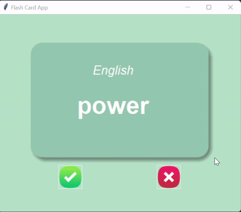

## Flash Card App

## Summary

- Used pandas library to import csv and convert it to dictionary
- Dictionary keys was English and French to create a French card and English card
- TKinter module used to create the GUI
- Removed known words from dictionary and converted it back to dataframe to save 

